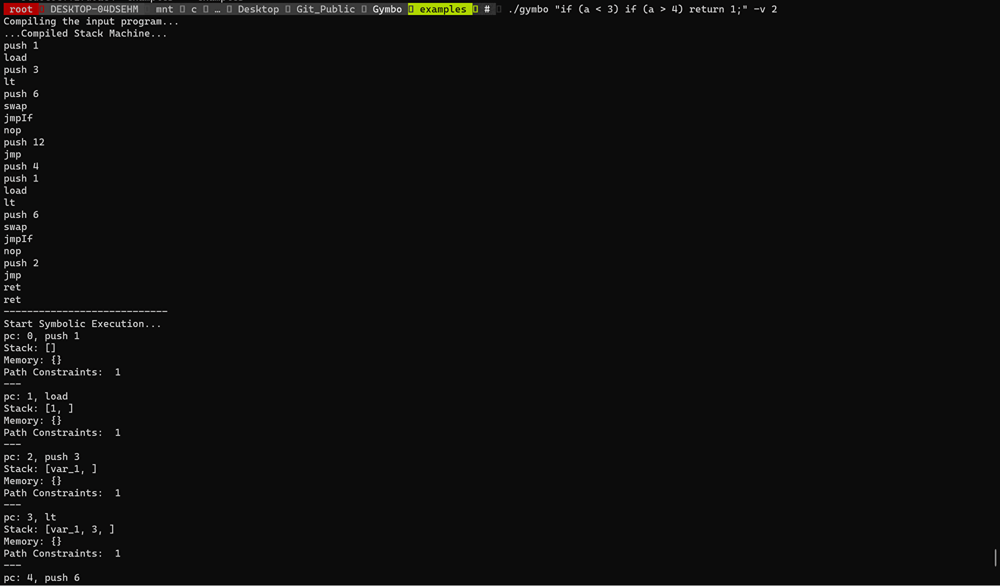

# Gymbo : Gradient - based Symbolic Execution



Gymbo is a Proof of Concept for a Gradient-based Symbolic Execution Engine implemented from scratch. Building on recent advancements that utilize gradient descent to solve SMT formulas `[1, 2]`, Gymbo leverages gradient descent to discover input values that fulfill each path constraint during symbolic execution. For more information, check our [documentation](https://koukyosyumei.github.io/Gymbo/).

Compared to other prominent symbolic execution tools, Gymbo's implementation is notably simpler and more compact. We hope that this project will assist individuals in grasping the fundamental principles of symbolic execution and SMT problem-solving through gradient descent.


One practical usage of Gymbo is debugging ML models like neural networks to detect unexpected behaviors. For example, you can generate adversarial examples with Gymbo by converting neural networks to imperative programs.


> Please note that Gymbo is currently under development and may have bugs. Your feedback and contributions are always greatly appreciated.

Another unique feature of Gymbo is that it can track the probabilistic symbolic variables. We adopt the PBRANCH algorithm proposed in `[3]` and currently support the discrete uniform, bernoulli, and binomial distributions.

## Install

```bash
git clone https://github.com/Koukyosyumei/Gymbo.git
./script/build.sh
```

## Quick Starts

Check out some examples in the [example](example) directory:

- [simple program](example/basic/simple.sh)
- [searching adversarial examples agaisnt neural networks](example/nn/nn_sklearn.py)
- [solving Monty Hall problem](example/randomized/montyhall.sh)

## Input Source Code Grammar

Gymbo presently supports C-like programs with the following BNF grammar:

```
program    = stmt*
stmt       = expr ";"
           | "{" stmt* "}"
           | "if" "(" expr ")" stmt ("else" stmt)? 
           | "return" expr ";"
expr       = assign
assign     = logical ("=" assign)?
logical    = equality ("&&" equality | "||" equality)*
equality   = relational ("==" relational | "!=" relational)*
relational = add ("<" add | "<=" add | ">" add | ">=" add)*
add        = mul ("+" mul | "-" mul)*
mul        = unary ("*" unary | "/" unary)*
unary      = ("+" | "-")? primary
primary    = num | ident | "(" expr ")"
```

> Please note that Gymbo currently ignores `/` when solving path constraints.

## Internal Algorithm

Gymbo converts the path constraint into a numerical loss function, which becomes negative only when the path constraint is satisfied. Gymbo uses the following transformation rule:

```
!(a)     => -a + eps
(a < b)  => a - b + eps
(a <= b) => a - b
(a > b)  => b - a + eps
(a >= b) => b - a
(a == b) => abs(a - b)
(a != b) => -abs(a - b) + eps
(a && b) => max(a, b)
(a || b) => min(a, b)
```

Here, `eps` is the smallest positive value of the type for a and b.

For example, when `a` and `b` are integers (`eps = 1`),  `(a < 3) && (!(a < 3) || (b == 5))` becomes `max(a - 2, min(3 - a, abs(b - 5)))`.

Optionally, Gymbo can use DPLL (SAT solver) to decide the assignment for each unique term, sometimes resulting in better scalability. For example, applying DPLL to the above example leads to `(a < 3)` being true and `(b == 5)` being true. Gymbo then converts this assignment into a loss function to be solved: `max(a - 2, abs(b - 5))`.

## CLI Tool

`gymbo` command accepts the following command-line options:

- `-d`: Set the maximum depth for symbolic execution (default: 256).
- `-v`: Set the verbosity level (default: 1). Use -1 for minimal output.
```
    -1: the number of satisfiable path constraints and unsatisfiable path constraints.
    0: + the list of unique unsatisfiable path constraints.
    1: + estimated concrete parameters for each path constraint.
    2: + trace at each operation, including the content of the virtual stack and memory.
    3: + complete stack machine.
```
- `-i`: Set the number of iterations for gradient descent (default: 100).
- `-a`: Set the step size for gradient descent (default: 1.0).
- `-e`: Set the eps for the differentiable expression (default: 1.0).
- `-t`: Set the maximum number of trials of gradient descent (default: 3) 
- `-l`: Set the minimum value of initial parameters (default: -10)
- `-h`: Set the maximum value of initial parameters (default: 10)
- `-s`: Set the random seed (default: 42)
- `-p`: (optional) If set, use DPLL to determine the assignment for each term. Otherwise, solve the loss function directly transformed from the path constraints.

```bash
./gymbo "if (a < 3) if (a > 4) return 1;" -v 0

>Compiling the input program...
>Start Symbolic Execution...
>---------------------------
>Result Summary
>#Total Path Constraints: 4
>#SAT: 3
>#UNSAT: 1
>List of UNSAT Path Constraints
># var_1 < 3 and 4 < var_1 and  1
```



## `libgymbo`: Header-only Library

Since gymbo consists of the header-only library, you can easily create your own symbolic execution tool.

```cpp
#include "libgymbo/compiler.h"
#include "libgymbo/gd.h"
#include "libgymbo/parser.h"
#include "libgymbo/tokenizer.h"
#include "libgymbo/type.h"

char user_input[] = "if (a < 3) return 1;"

std::vector<gymbo::Node *> code;
gymbo::Prog prg;
gymbo::GDOptimizer optimizer(num_itrs, step_size);
gymbo::SymState init;
gymbo::PathConstraintsTable cache_constraints;

// tokenize the input source code
gymbo::Token *token = gymbo::tokenize(user_input);
// generate AST from the tokens
gymbo::generate_ast(token, user_input, code);
// construct virtual stack machine from AST
gymbo::compile_ast(code, prg);

// execute gradient-based symbolie execution
gymbo::SExecutor executor(optimizer, maxSAT, maxUNSAT, max_num_trials,
                          ignore_memory, use_dpll, verbose_level);
executor.run(prg, target_pcs, init, max_depth);
```

## Python API

### Install 

```
pip install git+https://github.com/Koukyosyumei/Gymbo
```

### `pylibgymbo`: Python Wrapper for `libgymbo`

```Python
import pylibgymbo as plg

inp = "a = 1; if (a == 1) return 2;"
var_counter, prg = plg.gcompile(inp)

optimizer = plg.GDOptimizer(num_itrs, step_size, ...)
executor = plg.SExecutor(optimizer, maxSAT, maxUNSAT, max_num_trials,
                         ignore_memory, use_dpll, verbose_level)
executor.run(prg, target_pcs, init, max_depth)
```

### `pymlgymbo`: Debugging Machine Learning Models


We offer some helper functions within `pymlgymbo` library to convert the ML models of famous Python library like sklearn and PyTorch to the program that gymbo can process.

The following code generates the adversarial examples against a neural network, as proposed in `[4]`.

```python
from sklearn.neural_network import MLPClassifier

import pylibgymbo as plg
import pymlgymbo as pmg

clf = MLPClassifier(activation="relu")
clf.fit(X_train, y_train)


mlp_code = pmg.dump_sklearn_MLP(clf, feature_names)
adv_condition = (
        "("
        + " || ".join(
            [f"(y_{c} > y_{y_pred})" for c in range(len(clf.classes_)) if y_pred != c]
        )
        + ")"
    )

optimizer = plg.GDOptimizer(num_itrs, step_size, ...)
var_counter, prg = plg.gcompile(mlp_code)

executor = plg.SExecutor(optimizer, maxSAT, maxUNSAT, max_num_trials,
                         ignore_memory, use_dpll, verbose_level)
executor.run(prg, target_pcs, init, max_depth)
```

## Acknowledgement

Gymbo is entirely implemented in C++ and requires only standard libraries. The process of compiling from source code to stack machines is based on the implementation of `rui314/chibicc [5]`, while the symbolic execution approach is inspired by `beala/symbolic [6]`.

## Reference

```
- [1] Chen, Peng, Jianzhong Liu, and Hao Chen. "Matryoshka: fuzzing deeply nested branches." Proceedings of the 2019 ACM SIGSAC Conference on Computer and Communications Security. 2019.
- [2] Minghao Liu, Kunhang Lv, Pei Huang, Rui Han, Fuqi Jia, Yu Zhang, Feifei Ma, Jian Zhang. "NRAgo: Solving SMT(NRA) Formulas with Gradient-based Optimization." IEEE/ACM International Conference on Automated Software Engineering, 2023
- [3] Susag, Zachary, et al. "Symbolic execution for randomized programs." Proceedings of the ACM on Programming Languages 6.OOPSLA2 (2022): 1583-1612.
- [4] Gopinath, Divya, et al. "Symbolic execution for importance analysis and adversarial generation in neural networks." 2019 IEEE 30th International Symposium on Software Reliability Engineering (ISSRE). IEEE, 2019.
- [5] https://github.com/rui314/chibicc
- [6] https://github.com/beala/symbolic
```
