# Gymbo: Gradient-based Symbolic Execution 



Gymbo is a Proof of Concept for Gradient-based Symbolic Execution Engine implemented from scratch. Gymbo uses gradient descent to solve path constraints. 

## Install

```bash
git clone https://github.com/Koukyosyumei/Gymbo.git
./build.sh
```

## CLI Tool

```bash
 ./gymbo "if (a < 3) return 1;"
```

The tool accepts the following command-line options:

- `-d` [max\_depth]: Set the maximum depth for symbolic execution (default: 256).
- `-v` [verbose\_level]: Set the verbosity level (default: 1). Use 0 for minimal output.
- `-i` [num\_itrs]: Set the number of iterations for gradient descent (default: 100).
- `-a` [step\_size]: Set the step size for gradient descent (default: 1).

## Header-Only Library

```cpp
char user_input[] = "if (a < 3) return 1;"

std::vector<Node *> code;
Prog prg;
GDOptimizer optimizer(num_itrs, step_size);
SymState init;
PathConstraintsTable cache_constraints;

Token *token = tokenize(user_input);
generate_ast(token, user_input, code);
compile_ast(code, prg);

symRun(prg, optimizer, init, cache_constraints);
```

## Reference


